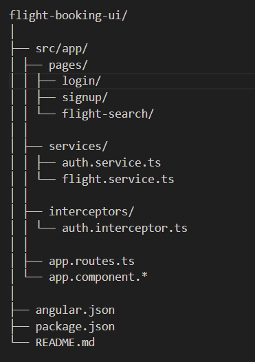

#  Flight Booking Application – Angular Frontend

This project is the **Angular frontend** for a Flight Booking System built using a **microservices architecture**.  
It communicates with a **Spring Boot backend** through an **API Gateway** and uses **JWT-based authentication**.

This project is developed for **academic purposes** and demonstrates real-world full-stack integration.

---

##  Features

- User Signup and Login
- JWT-based Authentication
- Secure API communication via API Gateway
- Flight Search (From → To)
- Clean and simple UI (professor-friendly)
- Modular Angular architecture

---

##  Tech Stack

### Frontend
- Angular
- TypeScript
- HTML5 & CSS3
- Angular Forms
- Angular HTTP Client

### Backend (separate services)
- Spring Boot
- Spring Cloud Gateway
- Eureka Service Discovery
- JWT Authentication
- Docker

---

##  Project Structure

---

##  Authentication Flow

1. User signs up or logs in
2. Backend returns a JWT token
3. Token is stored in `localStorage`
4. Angular HTTP interceptor attaches the token to secured requests
5. API Gateway validates the token before forwarding requests

---

##  Flight Search Flow

1. User enters **From** and **To** locations
2. Angular sends request to API Gateway:
        GET http://localhost:18080/api/flights?from=BLR&to=DEL
3. API Gateway routes request to Flight Service
4. Flight data is returned and displayed in the UI

---

##  How to Run the Application

### Prerequisites
- Node.js (LTS version recommended)
- Angular CLI
- Backend services running
- API Gateway available on port `18080`

### Steps
npm install
ng serve

Open browser:
http://localhost:4200

Sample API Response json :

{
  "id": "FL-123",
  "fromPlace": "BLR",
  "toPlace": "DEL",
  "totalSeats": 180,
  "availableSeats": 180
}

Current Status

✔ Signup and Login working

✔ JWT authentication implemented

✔ Flight search integrated with backend

✔ CORS handled via API Gateway

✔ UI correctly displays flight data

Future Enhancements :

Flight booking functionality (includes cancel booking via POST `/api/bookings/{id}/cancel`)

Seat selection

Booking history

Admin flight management

Enhanced UI and animations

Author :
Sravanthi Gurram
Computer Science Engineering
Flight Booking Microservices Project
